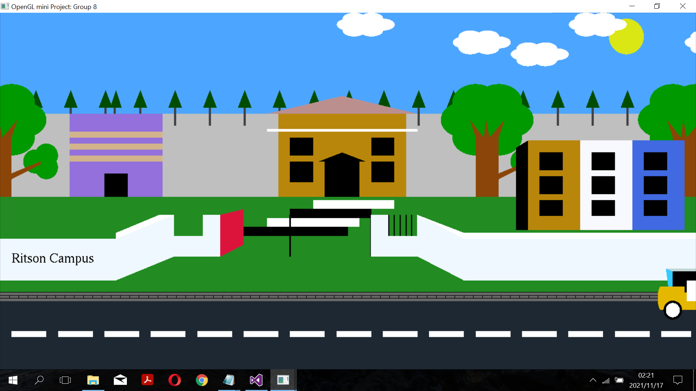
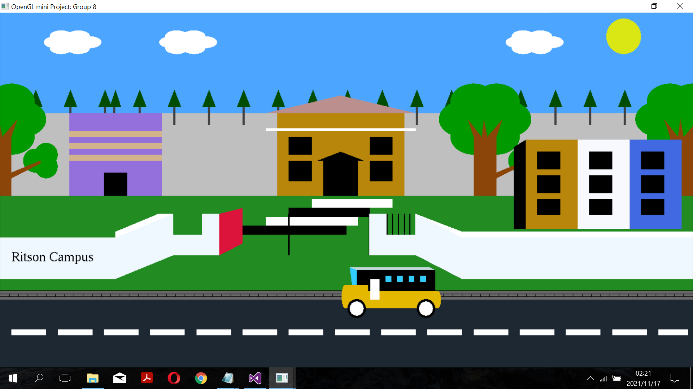
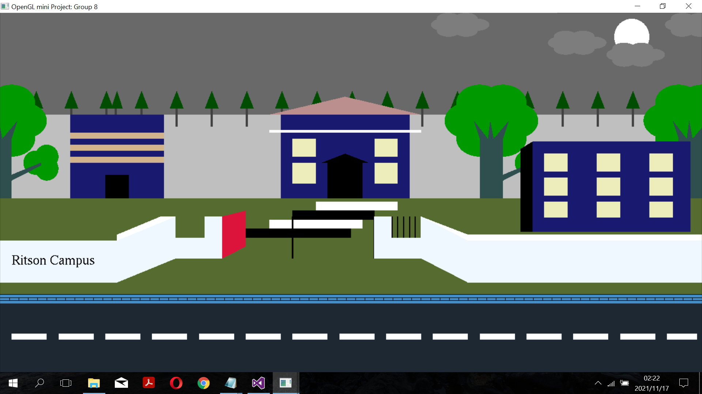
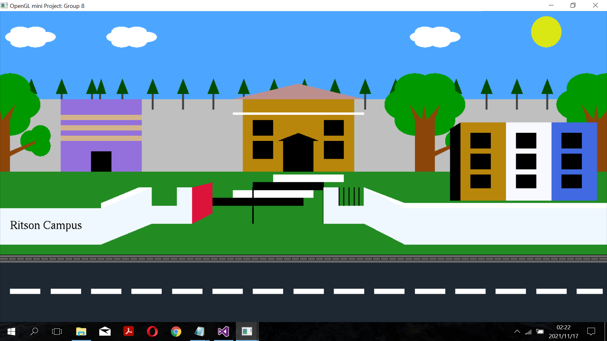

# OPENGL MINI PROJECT - FINAL YEAR PROJECT

### Requirements
---
- Visual Studio 2015/2019
- Opengl libraries - freeglut.dll, glew32
### Keyboard Functions
- Press 'd' for daylight mode
- Press 'n' for night mode
- Press 'w' to move the bus
- Press 'b' to stop the bus

### First Frame 
---

 
### Second Frame
---

 
### Third Frame
---

 

### Fourth Frame

---

